

# Copias de seguridad con DUPLICATI

***Nombre:*** Hugo suárez Pérez

***Curso:*** 2º de Ciclo Superior de Administración de Sistemas Informáticos en Red.

### ÍNDICE

+ [Introducción](#id1)
+ [Objetivos](#id2)
+ [Material empleado](#id3)
+ [Desarrollo](#id4)
+ [Conclusiones](#id5)

#### ***Introducción***. 

DUPLICATI es un servicio opensource y multiplataforma  que nos permite realizar copias de seguridad en local y hacia la nube

#### ***Objetivos***. 

Utilizando esta aplicación, realizar las siguientes tareas:

1.Instalar la aplicación en Ubuntu

2.Crear en un servicio en la nube de nuestra elección la carpeta "DupBackUp"

3.Configurar en duplicati la realización de la copia de seguridad hace la carpeta que hemos creado en la nube, con las siguientes características:

-La copia debe ser incremental.

-La copia debe estar cifrada.

4.Planificar un backup completo del directorio de datos (Documentos) del usuario que estamos utilizando. Programar dicho backup para realizarlo todos los días a las 23:30

5.Realizar el  procedimiento de comprobación de la integridad de las copias realizadas y de recuperación de la la información.

#### ***Material empleado***. 

1 Máquina Virtual Ubuntu

#### ***Desarrollo***. 

Instalamos Duplicati por terminal.

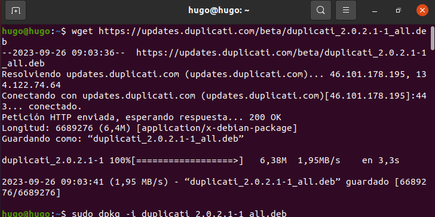

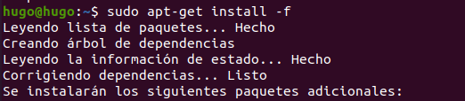

Miramos que está instalado y lo abrimos

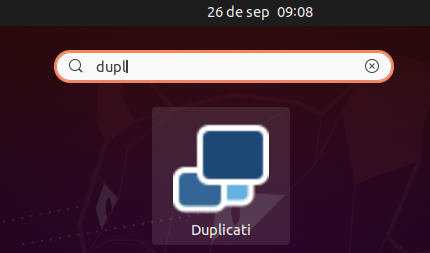

Creamos una copia de seguridad con la configuración indicada en el ejercicio.

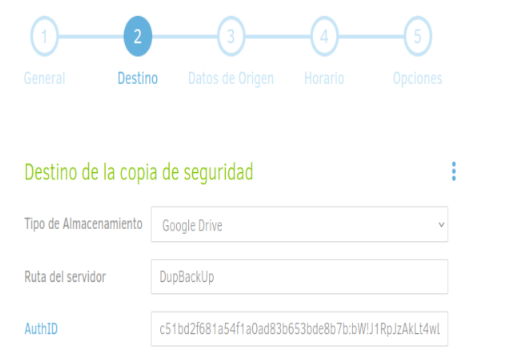

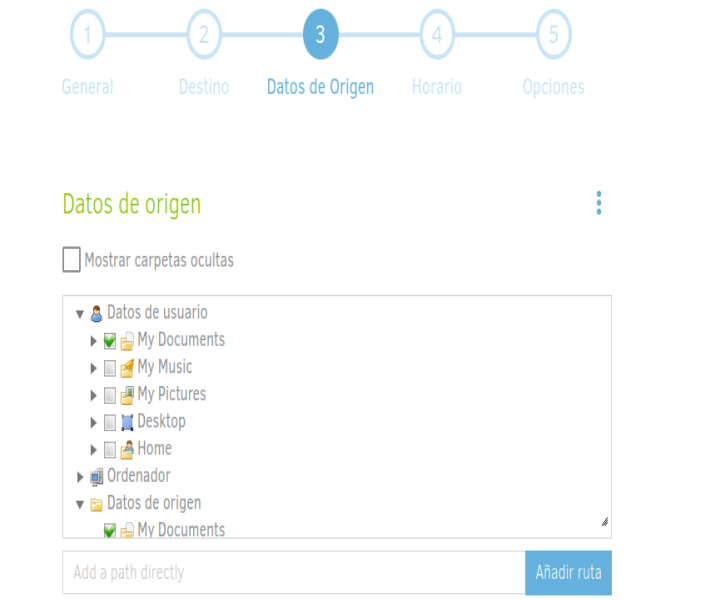

Miramos que está y le damos a ejecutar ahora.

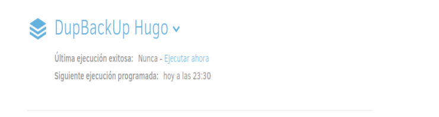

Vemos que en drive se creo la carpeta con los archivos.

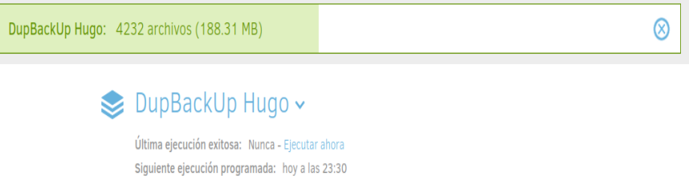

Borramos.

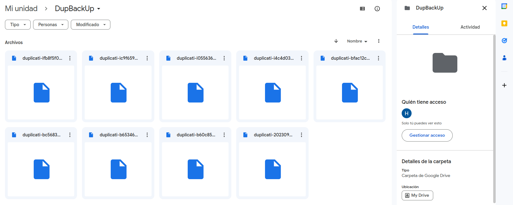

Y Restauramos con las indicaciones adecuadas.

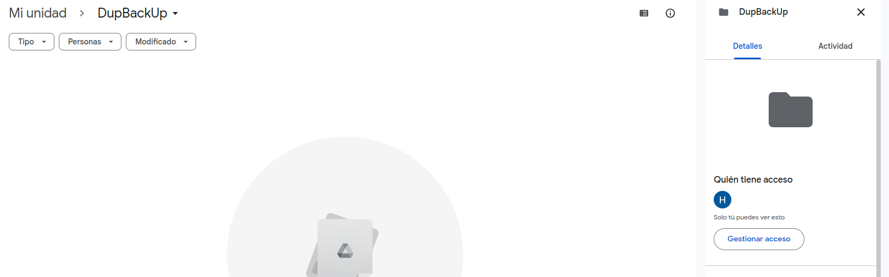

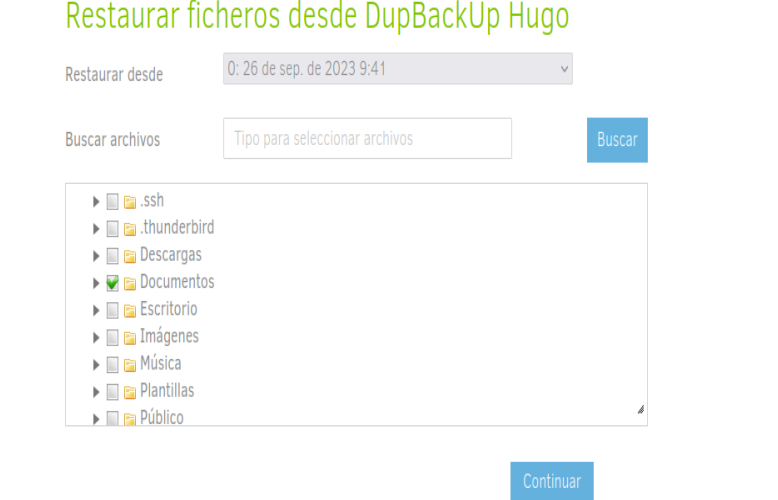

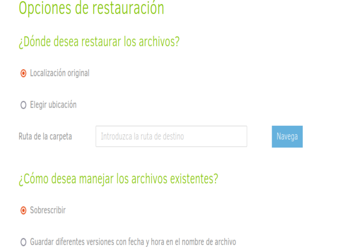

#### ***Conclusiones***. 

Duplicati es una buena herramienta para hacer copias de seguridad ya sea dentro del ordenador o en la nube.
