

# Práctica con rsync

***Hugo Suárez Pérez:***

***Curso:*** 2º de Ciclo Superior de Administración de Sistemas Informáticos en Red.

### ÍNDICE

+ [Introducción](#id1)
+ [Objetivos](#id2)
+ [Material empleado](#id3)
+ [Desarrollo](#id4)
+ [Conclusiones](#id5)

#### ***Introducción***. 

rsync es una aplicación libre para sistemas de tipo Unix y Microsoft Windows que ofrece transmisión eficiente de datos incrementales, que opera también con datos comprimidos y cifrados. Mediante una técnica de delta encoding, permite sincronizar archivos y directorios entre dos máquinas de una red o entre dos ubicaciones en una misma máquina, minimizando el volumen de datos transferidos. Una característica importante de rsync no encontrada en la mayoría de programas o protocolos es que la copia toma lugar con sólo una transmisión en cada dirección. rsync puede copiar o mostrar directorios contenidos y copia de archivos, opcionalmente usando compresión y recursión.

Actuando como un daemon de servidor, rsync escucha por defecto el puerto TCP 873, sirviendo archivos en el protocolo nativo rsync o vía un terminal remoto como RSH o SSH. En el último caso, el ejecutable del cliente rsync debe ser instalado en el host local y remoto.

rsync se distribuye bajo la licencia GNU General Public License.

#### ***Objetivos***. 

Cada miembro del grupo debe montar una máquina con sistema operativo Linux  a elegir ( Debian, Ubuntu, etc ) configurándola de la forma siguiente:

Una interfaz de red en modo puente. 
Una IP configurada en modo estático, para ello podemos fijar la dirección MAC  de la máquina haciendo uso de la que ya tenemos reservada en el DHCP.
El  hostname  de cada máquina debe ser 'rsync1' y 'rsync2' 
Comprobar que las máquinas se ven entre sí realizando ping entre ellas.
Compruebe si ambas máquinas tienen instalado y habilitado el protocolo rsync, en caso de que no esté instalado debe proceder a instalarlo y habilitarlo documentando los pasos seguidos.
Una vez configurado el entorno de trabajo se seguirán los pasos siguientes  pasos para comprender el funcionamiento del protocolo rsync:

En la primera máquina virtual ( rsync1 ) construya el directorio: ~/datos
Ejecute el comando: touch datos/fichero-{1..100}.txt
Observe el contenido del directorio datos. Después utilice rsync para sincronizar el directorio datos de la primera ( rsync1 ) a la segunda máquina ( rsync2 ).
Utilice un editor para editar alguno de los 100 ficheros escribiendo en su interior algunas líneas de texto.
Utilice de nuevo rsync para sincronizar el directorio. ¿Se transfieren todos los ficheros?
Borre el fichero datos/fichero-100.txt y sincronice el directorio. 
En el destino ¿existe el fichero?
¿Qué opción se debe utilizar para que en el destino se borren los ficheros que no existen en el origen?
¿Qué debe hacer para sincronizar de manera recursiva el directorio /etc/systemd de la primera máquina a ~/systemd en la segunda máquina?

#### ***Material empleado***. 

Enumeramos el material empleado tanto hardware como software y las conficuraciones que hacemos (configuraciones de red por ejemplo) 

#### ***Desarrollo***. 
Vamos a la máquina virtual 1 y comprobamos que la ip está bien puesta gracias a ponerle la mac.

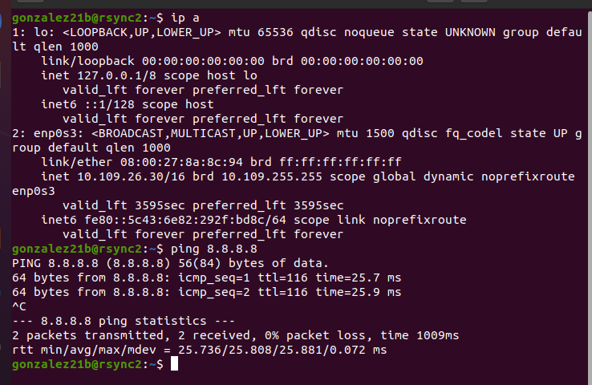

Hacemos ping a la otra máquina virtual.

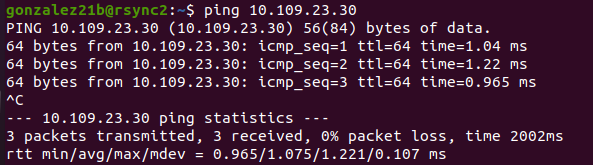

Le cambiamos el hostname a rsync1 e instalamos el servicio rsync

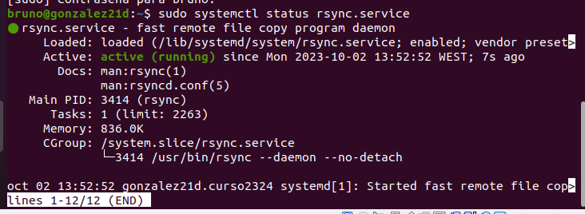

En la máquina virtual 2 le ponemos la mac proporcionada por el profedor.

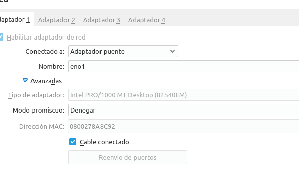

Le cambiamos el hostname.

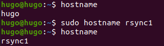

Comrpobamos ping a la otra máquina virtual.

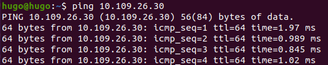

Instalamos rsync

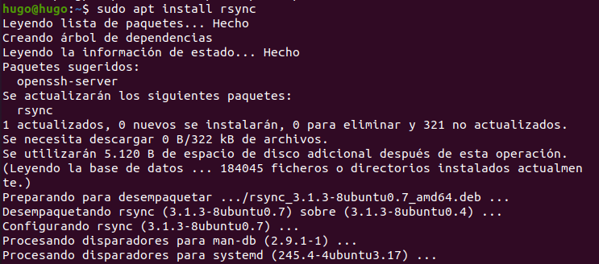

Instalamos ssh.

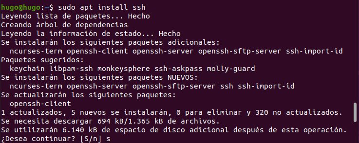

Creamos el siguiente fichero y miramos el estado de rsync.

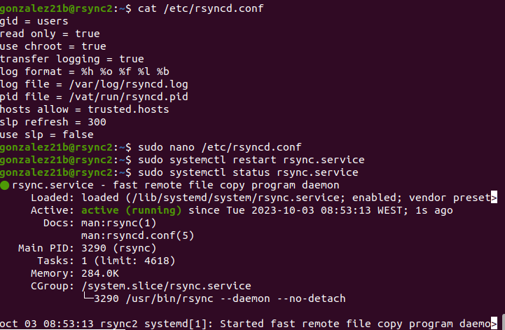

Rsync1 crea la carpeta datos. 

Pone el siguiente comando para generar 100 archivos.

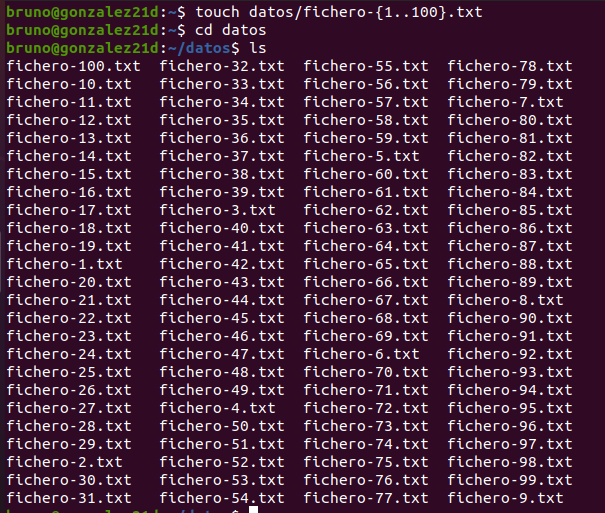

Rsync a la otra máquina virtual.

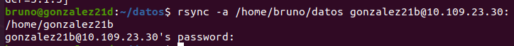

En rsync2 miramos que se a creado esa carpeta tambien.

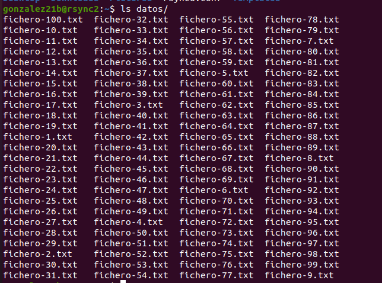

Editamos un archivo.

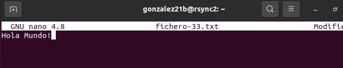

Hacemos rsync a la primera máquina virtual.

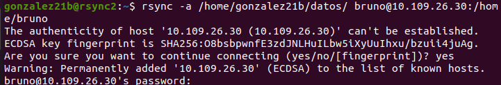

Y vemos que se han creado los archivos.

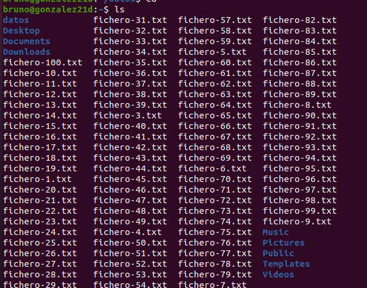

Con el archivo editado.

Borrramos el archivo 100.

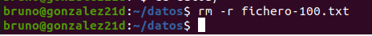

Y le mandamos la informacion a la otra máquina virtual para que tambien borre los archivos que ya no estan en nuestra máquina virtual.

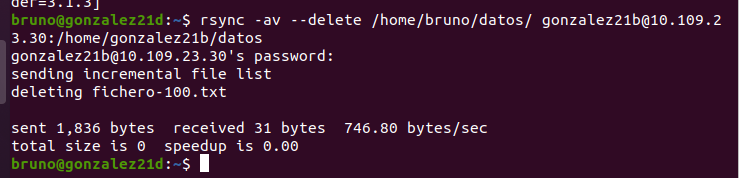

Y vemos que se borra.

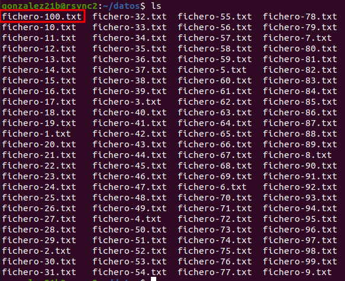

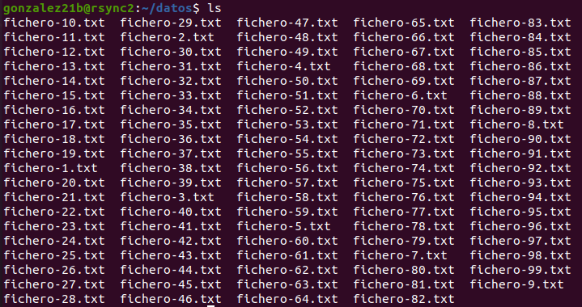

Sincronizamos de manera recursiva el directorio /etc/systemd de la primera máquina a ~/systemd en la segunda máquina

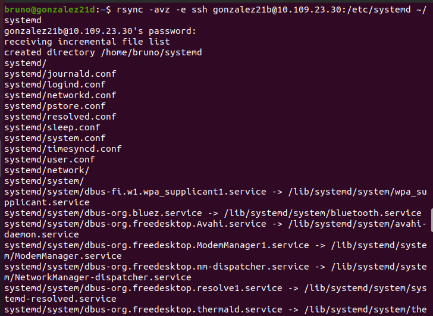

#### ***Conclusiones***. 

Hemos aprendido como instalar rsync y como configurarla para hacerla funcionar.
